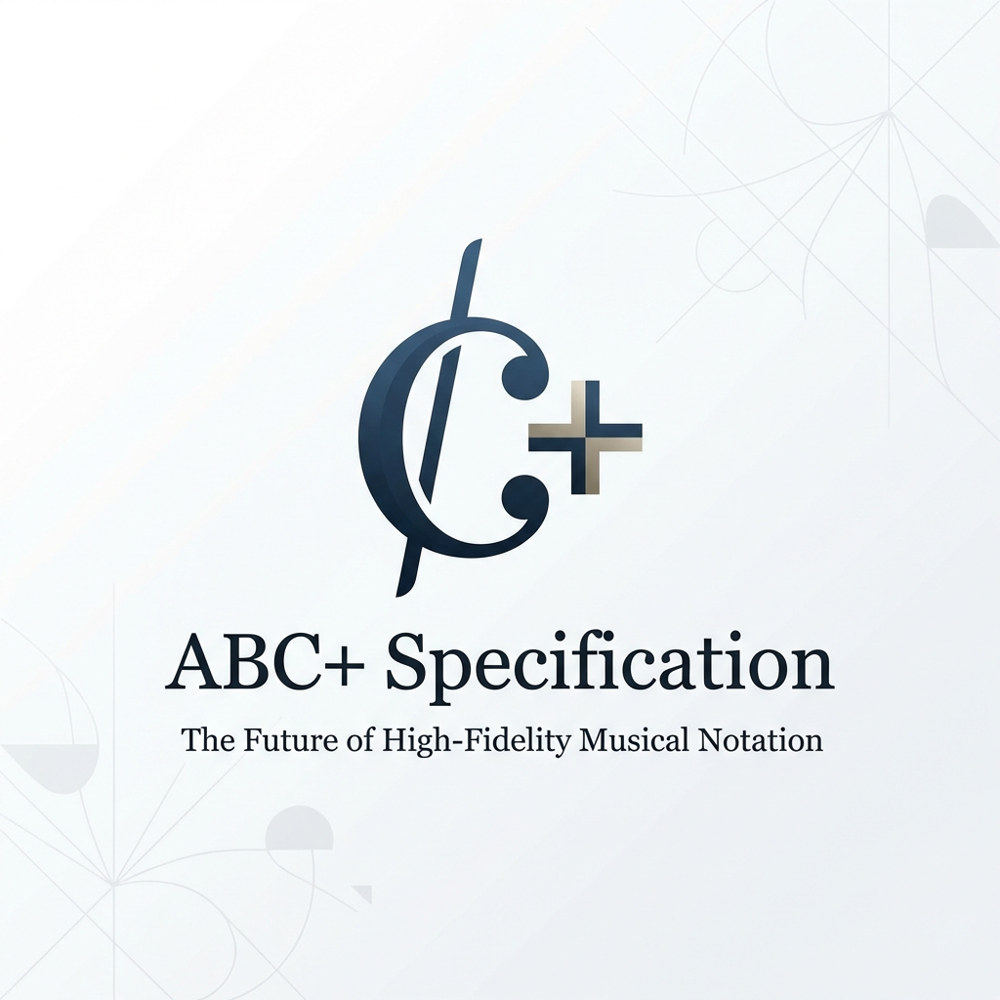

# ABC+ Notation Specification



**ABC+** is a professional evolution of the [ABC notation](https://abcnotation.com/) standard. It introduces high-fidelity musical directives designed for modern music applications, game audio orchestration, and advanced MusicXML 4.0 interchange.

## Quick Start

```abc
X:1
T:Example Song
M:4/4
L:1/8
K:C
%%dir mood="energetic"
"C"C2DE F2GA | "G"B2AG "C"c4 |
w: Hel-lo world, this is ABC+!
```

## Features

- ✅ Full ABC notation compatibility
- ✅ Custom directives (`%%dir`, `%%fx`, `%%loop`)
- ✅ Enhanced articulation, ornaments, and dynamics
- ✅ Playback control (`%%swing`, `%%mute`)
- ✅ Advanced layout (`%%vskip`, `%%sep`, `%%measurenumbering`)
- ✅ Game audio integration (`%%game_state`)
- ✅ MusicXML 4.0 export support

## Documentation

| Document | Description |
| :--- | :--- |
| [SPECIFICATION.md](SPECIFICATION.md) | Complete syntax reference |
| [CHANGELOG.md](CHANGELOG.md) | Version history |
| [CHECKLIST.md](CHECKLIST.md) | Detailed MusicXML element coverage |
| [examples/](examples/) | Sample ABC+ files |

## Installation

ABC+ is a notation format. To use it:

1. **Write ABC+ files** using any text editor
2. **Convert to MusicXML** using the [ABC+ Web Converter](https://github.com/leedale30/abc-to-xml-converter)
3. **Import into** notation software (MuseScore 4, Sibelius, Finale)

## Version

Current specification version: **1.2.0**

## License

MIT License - See [LICENSE](LICENSE) for details.

## Related Projects

- [abc-to-xml-converter](https://github.com/leedale30/abc-to-xml-converter) - ABC+ to MusicXML converter app
